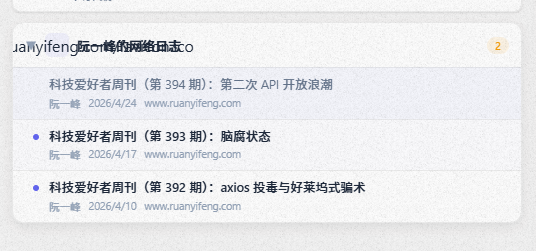

# RSS Feed Reader — SiYuan Note Plugin

A modern, elegant RSS feed reader plugin for [SiYuan Note](https://github.com/siyuan-note/siyuan).

Read your favorite blogs, news sites, and YouTube channels directly inside SiYuan Note — with full article content, dark mode support, OPML import, and one-click saving to your notebook.

<p align="center">
  
</p>

## ✨ Features

- **Multi-format Support** — RSS 2.0, Atom, and YouTube channel feeds (with `media:description` support)
- **Read Inside SiYuan** — A built-in reader panel renders full article content without leaving the app
- **One-click Save** — Save any article as a SiYuan note with one click
- **Feed Organization** — Create folders to manage your subscriptions, drag to reorganize
- **OPML Import** — Import your existing subscriptions from other RSS readers
- **Dark Mode** — Full dark theme support, matching SiYuan's UI
- **Unread Badges** — Track unread counts per feed and per folder
- **Auto-refresh** — Configurable auto-refresh interval
- **Article Positioning** — New articles can be prepended (top) or appended (bottom)
- **YouTube Support** — Parses `media:group/media:description` from YouTube Atom feeds

## 📦 Installation

### From GitHub (Recommended)

1. Download the latest `package.zip` from the [Releases](https://github.com/your-username/rss-feed-reader/releases) page
2. In SiYuan Note, go to **Settings → Marketplace → Plugins**
3. Click **Import Plugin** and select the downloaded zip
4. Enable the plugin

### Manual Installation

1. Build from source:
   ```bash
   git clone https://github.com/your-username/rss-feed-reader.git
   cd rss-feed-reader
   npm install
   npm run build
   ```
2. Copy `dist/` contents to your SiYuan plugin directory:
   ```
   {workspace}/data/plugins/rss-feed-reader/
   ```

### Environment Variables (for Development)

| Variable | Description |
|----------|-------------|
| `SIYUAN_TOKEN` | Your SiYuan API token |
| `SIYUAN_PLUGIN_DIR` | Path to the plugin directory for auto-deploy |
| `SIYUAN_URL` | SiYuan server URL (default: `http://127.0.0.1:6806`) |

## 🚀 Quick Start

1. Click the **RSS Feed** icon in the left dock bar
2. Switch to the **Settings** tab (⚙️)
3. Click **＋ Add Subscription**
4. Enter a feed URL (e.g., `https://sspai.com/feed`) and click **Detect & Add**
5. Switch back to the **Feeds** tab (📰) to browse articles
6. Click an article to open the reader, then click **⬇ Download** to save to your notebook

### Adding a YouTube Channel

YouTube channels use a special URL format:

```
https://www.youtube.com/feeds/videos.xml?channel_id=CHANNEL_ID
```

The plugin automatically parses video descriptions from the `media:description` namespace.

### Importing from OPML

1. In the **Settings** tab, click **📂 Import OPML**
2. Select your `.opml` file (exported from Feedly, Inoreader, Reeder, etc.)
3. All feeds and folder structures will be imported automatically

## 📁 Project Structure

```
rss-feed-reader/
├── src/
│   ├── index.ts              # Plugin entry point
│   ├── rss-parser.ts         # RSS/Atom/OPML parser + HTML→Markdown converter
│   ├── store.ts              # Data persistence and state management
│   ├── types.ts              # TypeScript type definitions
│   ├── api.ts                # SiYuan API wrapper
│   ├── styles/
│   │   └── index.css         # Plugin stylesheet (light & dark themes)
│   └── views/
│       ├── dock.ts           # Main dock panel (tab navigation)
│       ├── feed-view.ts      # Feed/article list view
│       ├── reader-view.ts    # Article reader panel
│       └── settings-view.ts  # Settings & feed management
├── scripts/
│   ├── test-media-description.mjs  # Unit tests for media:description
│   ├── test-youtube-real.mjs       # YouTube API integration test
│   └── test-youtube-playwright.mjs # Playwright E2E test
├── package.json
├── plugin.json
├── vite.config.ts
└── tsconfig.json
```

## 🛠️ Development

```bash
# Install dependencies
npm install

# Build
npm run build

# Watch mode (auto-rebuild on changes)
npm run dev

# Run Playwright E2E tests
node scripts/test-youtube-playwright.mjs
```

## 🧪 Testing

The project includes multiple levels of testing:

| Test | File | Description |
|------|------|-------------|
| Unit | `scripts/test-media-description.mjs` | 6 scenarios — YouTube media:description parsing |
| Integration | `scripts/test-youtube-real.mjs` | Real YouTube API call with the exact feed URL |
| E2E | `scripts/test-youtube-playwright.mjs` | Browser-based test: add feed → verify content in reader |

## 🤝 Contributing

Pull requests are welcome! Please ensure:

1. Code follows the existing style and conventions
2. TypeScript compiles without errors (`npm run build`)
3. Tests pass for any new functionality

## 📄 License

MIT

---

**Built with ❤️ for the SiYuan community**
