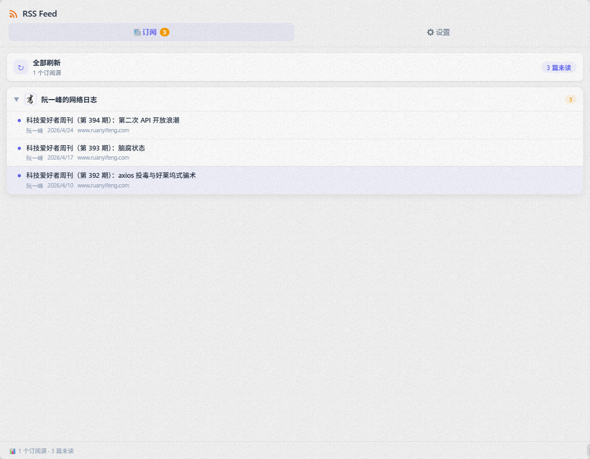

# RSS 订阅阅读器 — 思源笔记插件

一款现代、优雅的 RSS 订阅阅读器插件，专为[思源笔记](https://github.com/siyuan-note/siyuan)打造。

在思源笔记中直接阅读你喜爱的博客、新闻网站和 YouTube 频道 — 支持完整文章内容、暗色模式、OPML 导入和一键保存到笔记本。

<p align="center">
  
</p>

## ✨ 功能亮点

- **多格式支持** — RSS 2.0、Atom 以及 YouTube 频道 Feed（支持 `media:description` 和普通 description 解析）
- **内置阅读器** — 在思源内部直接阅读完整文章，无需跳转浏览器
- **一键下载** — 下载文章后自动跳转打开思源笔记，再次打开同一文章显示「📄 跳转查看」
- **订阅管理** — 创建文件夹分类管理订阅源，支持移动分组；文件夹可折叠展开
- **纯净名称** — 订阅名称自动清洗，不显示网址 URL；favicon 图标以图片渲染
- **OPML 导入导出** — 从 Feedly、Inoreader、Reeder 等导入现有订阅，也支持导出备份
- **折叠面板** — 订阅管理、通用设置均支持一键折叠，操作按钮始终可见
- **数据重置** — 通用设置中提供「清除全部」按钮，一键清空所有订阅数据
- **暗色模式** — 完整暗色主题，与思源 UI 无缝融合
- **未读标记** — 按订阅源和文件夹追踪未读数量
- **自动刷新** — 可配置的自动刷新间隔
- **文章排序** — 新文章可置顶（顶部）或追加（底部）
- **YouTube 支持** — 自动解析 YouTube Atom Feed 中的 `media:group/media:description` 内容
- **HTML 直出** — 非 CDATA 包裹的 description 内容正确渲染，避免二次转义
- **反限制模式** — 一键启用搜索引擎身份（Googlebot）抓取，突破新闻网站访问限制（覆盖 350+ 域名）

## 📦 安装

### 从 GitHub 安装（推荐）

1. 从 [Releases](https://github.com/jefere9901/rss-feed-reader/releases) 页面下载最新的 `package.zip`
2. 在思源笔记中，进入 **设置 → 集市 → 插件**
3. 点击 **导入插件**，选择下载的 zip 文件
4. 启用插件

### 手动安装

1. 从源码构建：
   ```bash
   git clone https://github.com/jefere9901/rss-feed-reader.git
   cd rss-feed-reader
   npm install
   npm run build
   ```
2. 将 `dist/` 目录内容复制到思源插件目录：
   ```
   {workspace}/data/plugins/rss-feed-reader/
   ```

### 环境变量（开发用）

| 变量 | 说明 |
|------|------|
| `SIYUAN_TOKEN` | 思源 API Token |
| `SIYUAN_PLUGIN_DIR` | 插件目录路径，用于自动部署 |
| `SIYUAN_URL` | 思源服务地址（默认: `http://127.0.0.1:6806`） |

## 🚀 快速上手

1. 点击左侧 Dock 栏的  **RSS Feed** 图标
2. 切换到 **设置** 标签页（⚙️）
3. 点击 **＋ 添加订阅**
4. 输入 Feed 地址（如 `https://sspai.com/feed`），点击 **检测并添加**
5. 切换回 **订阅** 标签页（📰）浏览文章
6. 点击文章打开阅读器，然后点击 **⬇ 下载** 保存到笔记本

### 添加 YouTube 频道

YouTube 频道使用特殊的 URL 格式：

```
https://www.youtube.com/feeds/videos.xml?channel_id=频道ID
```

插件会自动从 `media:description` 命名空间中解析视频描述内容。

### 从 OPML 导入

1. 在 **设置** 标签页中，点击 **📂 导入 OPML**
2. 选择你的 `.opml` 文件（支持从 Feedly、Inoreader、Reeder 等导出）
3. 所有订阅源和文件夹结构将自动导入

### 导出为 OPML

1. 在 **设置** 标签页中，点击 **📤 导出 OPML**
2. 浏览器将自动下载 `rss-subscriptions.opml` 文件
3. 可在其他 RSS 阅读器中导入该文件

### 管理订阅

- 点击文件夹标题可**折叠/展开**其下订阅源
- **双击**文件夹名称可重命名
- 每个订阅源可通过下拉菜单移动到其他文件夹
- 点击 **🔄 清除全部** 可一键重置所有数据

### 反限制模式

部分新闻网站对普通访问者实施付费墙或限制。**反限制模式**通过伪装为搜索引擎爬虫来突破这些限制：

1. 在 **设置** 标签页中，展开 **通用设置**
2. 找到 **反限制模式** 开关，点击开启
3. 添加或刷新订阅时，会自动使用 Googlebot 身份抓取

支持 **350+ 个新闻网站域名**，包括 The New York Times、Washington Post、Wall Street Journal、Bloomberg、Financial Times、The Economist、Forbes、Business Insider 等主流媒体。

## 📁 项目结构

```
rss-feed-reader/
├── src/
│   ├── index.ts              # 插件入口
│   ├── rss-parser.ts         # RSS/Atom/OPML 解析器 + HTML→Markdown 转换
│   ├── store.ts              # 数据持久化与状态管理
│   ├── types.ts              # TypeScript 类型定义
│   ├── api.ts                # 思源 API 封装
│   ├── bypass.ts             # 反限制规则引擎（350+ 域名 UA/Referer 映射）
│   ├── styles/
│   │   └── index.css         # 插件样式（明暗主题）
│   └── views/
│       ├── dock.ts           # 主面板（标签导航）
│       ├── feed-view.ts      # 订阅/文章列表视图
│       ├── reader-view.ts    # 文章阅读器面板
│       └── settings-view.ts  # 设置与订阅管理
├── scripts/
│   ├── deploy.mjs                       # 自动部署脚本
│   ├── pack.mjs                         # 打包脚本（生成 package.zip）
│   ├── render-icon.mjs                  # Logo 渲染脚本
│   ├── test-media-description.mjs       # media:description 单元测试
│   ├── test-youtube-real.mjs            # YouTube API 集成测试
│   ├── test-youtube-playwright.mjs      # YouTube Playwright E2E 测试
│   ├── test-feed-name-display.mjs       # 订阅名称不含 URL 测试
│   ├── test-import-ruanyifeng.mjs       # 导入阮一峰 RSS 端到端测试
│   ├── test-cnfeat.mjs                  # cnfeat.com RSS 全面测试
│   ├── test-cnfeat-deep.mjs             # cnfeat.com HTML 转义深度分析
│   ├── test-opml-export.mjs             # OPML 导出 E2E 测试
│   ├── test-settings-collapse.mjs       # 折叠/展开功能测试
│   ├── test-layout-refactor.mjs         # 布局重构验证测试
│   └── test-reset.mjs                   # 数据清除功能测试
├── icon.svg                  # 插件 Logo（SVG 源文件）
├── icon.png                  # 插件 Logo（160×160）
├── package.json
├── plugin.json
├── vite.config.ts
└── tsconfig.json
```

## 🛠️ 开发

```bash
# 安装依赖
npm install

# 构建
npm run build

# Watch 模式（修改自动重新构建）
npm run dev

# 打包发布
npm run pack
```

## 🧪 测试

项目包含多层测试覆盖：

| 测试类型 | 文件 | 说明 |
|------|------|------|
| 单元测试 | `scripts/test-media-description.mjs` | YouTube media:description 解析（6 场景） |
| 集成测试 | `scripts/test-youtube-real.mjs` | 真实 YouTube API 调用验证 |
| E2E 测试 | `scripts/test-youtube-playwright.mjs` | 添加 YouTube → 验证文章内容 |
| E2E 测试 | `scripts/test-import-ruanyifeng.mjs` | 导入阮一峰 RSS → 验证名称无 URL |
| E2E 测试 | `scripts/test-cnfeat.mjs` | cnfeat.com RSS → 验证 HTML 渲染（16 项） |
| E2E 测试 | `scripts/test-opml-export.mjs` | OPML 导出 → 文件结构 → 往返解析（16 项） |
| E2E 测试 | `scripts/test-settings-collapse.mjs` | 折叠/展开功能验证（12 项） |
| E2E 测试 | `scripts/test-layout-refactor.mjs` | 布局顺序 + 按钮位置验证（10 项） |
| E2E 测试 | `scripts/test-reset.mjs` | 数据清除 + 确认对话框（7 项） |
| E2E 测试 | `scripts/test-bypass-toggle.mjs` | 反限制开关 开启/关闭 + 状态持久化（13 项） |
| E2E 测试 | `scripts/test-bypass-compare.mjs` | 开/关两模式 RSS 内容对比（NYT Arts） |
| E2E 测试 | `scripts/test-full-download.mjs` | 下载→自动跳转→再次打开显示跳转 全流程（30+ 项） |
| 逻辑测试 | `scripts/test-feed-name-display.mjs` | cleanFeedName 降级策略 + 代码安全性 |

## 🤝 贡献

欢迎提交 Pull Request！请确保：

1. 代码遵循现有风格和规范
2. TypeScript 编译无错误（`npm run build`）
3. 新功能通过相关 Playwright 测试

## 📄 许可证

MIT

---

## 📮 联系方式

- **QQ 群组**：1102449017
- 欢迎交流反馈、提交 Issue 或 PR

<p align="center">
  
</p>
<p align="center">
  
</p>

---

**为思源社区用 ❤️ 构建**
